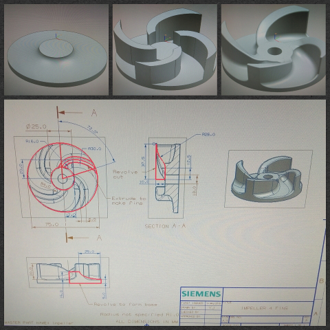

### My First Maker Project - Design  & Build an Impeller

This was my capstone project for a part-time ITE course in Machining which I took up because of my previous role in a oil & gas company.

For this project, I went through the whole process of designing and building a engineering product: an [impeller](https://en.wikipedia.org/wiki/Impeller), which is the rotating component of a centrifugal pump.

- First I came up with the engineering design and draft it out using NX CAD.
- The CAD drawing is then passed to NX CAM for design and simulation of the machining process.
- The CAM programs are then post processed to NC files that CNC machines can read.
- The stock material is prepared, the tooling set up and NC programs is loaded into the Mazak Multi-axes Machine Center.
- The CNC machine then cuts and mills the workpiece using the toolpaths defined in the NC files.

The CAD/CAM folder contains .prt files of the entire engineering product and process design which can be opened with NX version 8 or newer. The NC files are also available broken into 5 steps:

1. **Roughing** using a 12MM roughing endmill cutter
2. **Semi-finishing** using a 10MM finishing endmill cutter
3. **Finishing flat surface** at the top using same cutter in #2
4. **Z-level profile cuts** for finishing fin walls using a 8MM ballnose cutter
5. **Contour profiling** for finishing slope surface between fins using same cutter in #4
